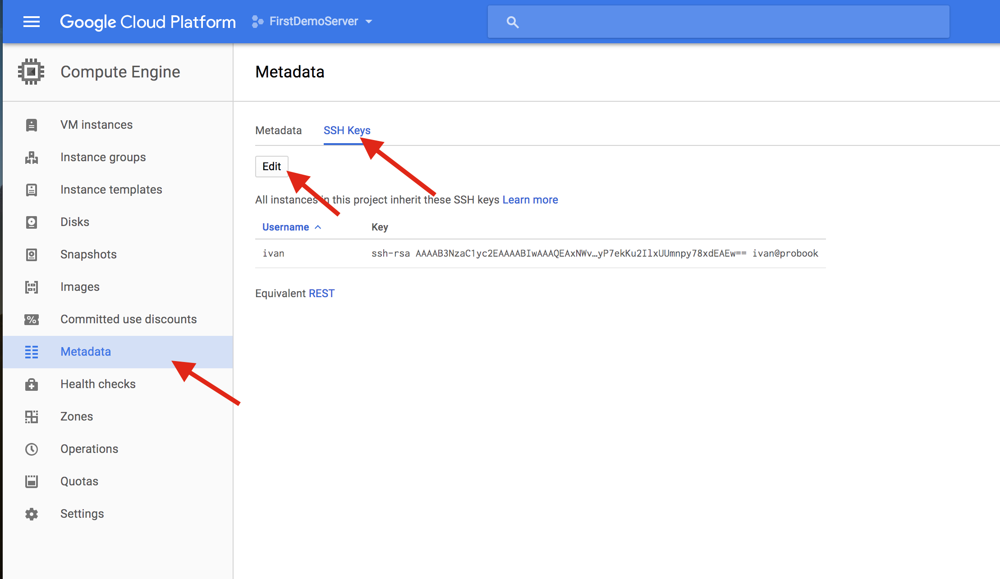
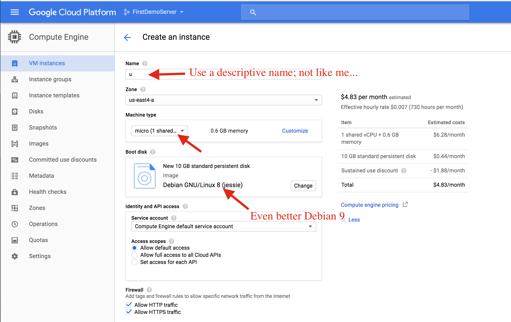
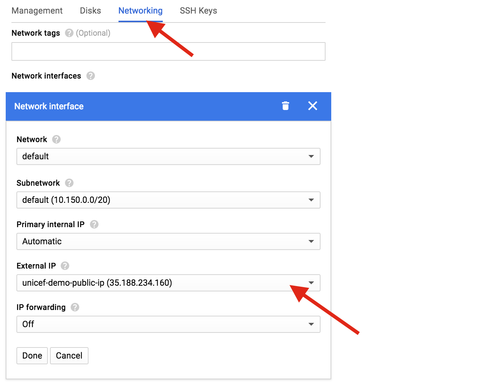

Provisioning a Google Cloud Platform Instance
=============================================

1. Make sure your ssh key is setup for the project

2. Choose a basic image (micro) with Debian

3. Choose the "assign Static IP" option from the Networking menu

References
----------
Short video that shows the manual steps required to "rent" a virtual machine:
https://www.youtube.com/watch?v=wXqHDcJ1JzY